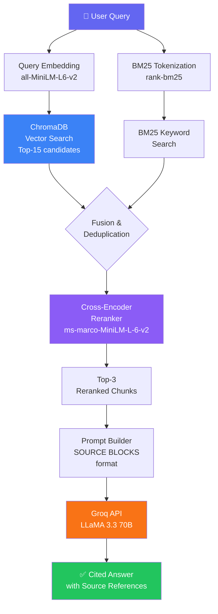

<div align="center">

<!-- Animated Banner -->


<!-- Animated Typing SVG -->
<a href="https://git.io/typing-svg">
  
</a>

<br/>

<!-- Core Badges Row -->
<p>
  
  
  
  
  
</p>

<!-- Status Badges -->
<p>
  
  
  
  
  
</p>

</div>

---

## 🌟 What is FilingIQ?

<div align="center">

```
╔══════════════════════════════════════════════════════════════════╗
║  📄  Ask ANY question in plain English about Indian company      ║
║       filings, annual reports & SEBI regulations                 ║
║                                                                  ║
║  🔍  Get back a precise, cited answer sourced directly from       ║
║       2,735 indexed document chunks — no hallucinations          ║
║                                                                  ║
║  ⚡  Powered by Hybrid RAG: BM25 + Vector Search + Cross-Encoder ║
╚══════════════════════════════════════════════════════════════════╝
```

</div>

**FilingIQ** is a production-grade **Retrieval-Augmented Generation (RAG)** system built to make financial and compliance research **10× faster**. It combines semantic vector search, BM25 keyword retrieval, and a cross-encoder reranker — then feeds the best evidence to **LLaMA 3.3 70B** running on **Groq's ultra-fast inference** to produce grounded, citation-backed answers.

---

## ✨ Feature Highlights

<table>
<tr>
<td width="50%">

### 🔮 AI Intelligence
- 🧠 **LLaMA 3.3 70B** via Groq API — state-of-the-art LLM
- 🔍 **Hybrid Retrieval** — BM25 + dense vector search fusion
- 📐 **Cross-Encoder Reranking** — ms-marco MiniLM for precision
- 🎯 **Citation-Aware** — every fact is traceable to a source page
- 🚫 **Zero Hallucination** — strict context-grounded generation

</td>
<td width="50%">

### ⚙️ Engineering
- ⚡ **Sub-3s responses** end-to-end including LLM generation
- 🐳 **Docker-ready** — one command to deploy anywhere
- 📦 **2,735 chunks** pre-indexed and ready to query
- 🛡️ **Health check endpoint** with automatic recovery
- 🌐 **CORS-enabled FastAPI** — works with any frontend

</td>
</tr>
<tr>
<td width="50%">

### 📚 Data Coverage
- 📊 **Reliance Industries** — FY2024, FY2025, FY2026
- 💻 **TCS** — FY2024, FY2025, FY2026
- 🟢 **Infosys** — FY2024, FY2025, FY2026
- ⚖️ **SEBI Regulations** — LODR 2015 & Insider Trading 2015

</td>
<td width="50%">

### 🎨 Developer Experience
- 📖 **Interactive Swagger UI** at `/docs`
- 🧪 **Dual API modes** — debug `/query` + clean `/chat`
- 🔧 **Memory-optimized ingest** — batch embedding pipeline
- 📝 **Structured logging** — full observability
- 🔄 **Easy to extend** — add any PDF in minutes

</td>
</tr>
</table>

---

## 🏗️ System Architecture

```
┌─────────────────────────────────────────────────────────────────────────────┐
│                          FilingIQ RAG Architecture                           │
└─────────────────────────────────────────────────────────────────────────────┘

  ┌──────────┐     HTTP/REST      ┌─────────────────────────────────────────┐
  │          │ ─────────────────► │             FastAPI Backend              │
  │  Browser │                   │          (src/api.py · Port 8000)        │
  │ Frontend │ ◄───────────────── │   /chat  ·  /query  ·  /health  ·  /    │
  │  :3000   │   JSON Response    └──────────────────┬──────────────────────┘
  └──────────┘                                       │
                                                     ▼
                              ┌──────────────────────────────────────┐
                              │          Retriever Pipeline           │
                              │           (src/retrieve.py)          │
                              │                                      │
                              │  ┌─────────────┐  ┌──────────────┐  │
                              │  │  BM25 Index │  │  ChromaDB    │  │
                              │  │  (keyword)  │  │ (vector DB)  │  │
                              │  └──────┬──────┘  └──────┬───────┘  │
                              │         └────────┬────────┘          │
                              │                  │ 15 candidates     │
                              │                  ▼                   │
                              │  ┌───────────────────────────────┐  │
                              │  │  Cross-Encoder Reranker        │  │
                              │  │  ms-marco-MiniLM-L-6-v2       │  │
                              │  │  → Top 3 most relevant chunks  │  │
                              │  └───────────────┬───────────────┘  │
                              └──────────────────┼───────────────────┘
                                                 │
                                                 ▼
                              ┌──────────────────────────────────────┐
                              │           Groq LLM API               │
                              │    LLaMA-3.3-70B-Versatile           │
                              │  Temperature=0 · Max tokens=1024     │
                              │  → Citation-grounded answer          │
                              └──────────────────────────────────────┘

  ═══════════════════════ INGESTION PIPELINE (Offline) ═══════════════════════

  ┌──────────────┐    ┌──────────────┐    ┌──────────────┐    ┌────────────┐
  │  PDF Files   │───►│  PyMuPDF     │───►│  Text        │───►│  all-      │
  │  (data/raw/) │    │  Parser      │    │  Chunker     │    │  MiniLM-   │
  │              │    │  • Skip OCR  │    │  400 tok     │    │  L6-v2     │
  │  11 docs     │    │  • Strip H/F │    │  50 overlap  │    │  Embedder  │
  └──────────────┘    └──────────────┘    └──────────────┘    └─────┬──────┘
                                                                     │
                                                                     ▼
                                                          ┌──────────────────┐
                                                          │   ChromaDB       │
                                                          │   Persistent     │
                                                          │   Vector Store   │
                                                          │   (./db/)        │
                                                          │   2,735 chunks   │
                                                          └──────────────────┘
```

---

## 🔬 RAG Pipeline Deep Dive



---

## 🧰 Tech Stack

<div align="center">

| Layer | Technology | Version | Purpose |
|:------|:-----------|:--------|:--------|
| 🌐 **API Framework** |  | `0.111.0` | REST endpoints, Pydantic validation, Swagger UI |
| 🗄️ **Vector Database** |  | `1.5.9` | Persistent local vector store with cosine similarity |
| 🧬 **Embeddings** |  | `5.5.1` | `all-MiniLM-L6-v2` — 384-dim dense embeddings |
| 📊 **Reranker** |  | — | `ms-marco-MiniLM-L-6-v2` cross-encoder |
| 🔠 **Keyword Search** | `rank-bm25` | `0.2.2` | BM25Okapi sparse retrieval |
| 🤖 **LLM** |  | 70B | Instruction-tuned, 128k context |
| ⚡ **LLM Inference** |  | — | Ultra-fast LPU inference (300+ tok/s) |
| 📄 **PDF Parsing** | `PyMuPDF (fitz)` | `1.24.1` | Block-level text extraction, header/footer removal |
| 🐍 **Runtime** |  | `3.12+` | Async-ready, type-safe |
| 🐳 **Containerization** |  | Latest | Multi-service single container |
| 🌐 **Frontend** |    | Vanilla | Zero-dependency chat UI |
| 🔧 **Server** |  | `0.24.0` | ASGI production server |

</div>

---

## 📁 Project Structure

```
filingiq/
│
├── 📂 src/                         # Core application logic
│   ├── 🐍 api.py                   # FastAPI app · 4 endpoints · CORS · startup init
│   ├── 🔄 ingest.py                # PDF → Chunks → Embeddings → ChromaDB pipeline
│   ├── 🔍 retrieve.py              # Hybrid retrieval · reranking · Groq LLM generation
│   └── ✅ verify_env.py            # Pre-flight environment validator
│
├── 📂 frontend/
│   └── 🌐 index.html               # Vanilla JS chat UI · Fetch API · source citations
│
├── 📂 db/                          # ChromaDB persistent vector store (2,735 chunks)
│
├── 📂 data/                        # (Not committed) Place raw PDFs here
│   └── raw/                        # 11 PDF filings go here for ingestion
│
├── 📂 .github/
│   └── workflows/                  # CI/CD pipeline configuration
│
├── 🐳 Dockerfile                   # Python 3.12-slim · dual-port · health check
├── 🐙 docker-compose.yml           # One-command orchestration
├── ⚙️  config.py                   # All tuneable parameters in one place
├── 📋 requirements.txt             # 9 pinned production dependencies
├── 🚫 .gitignore                   # Excludes venv, .env, raw PDFs
└── 📖 README.md                    # This file
```

---

## ⚡ Quick Start

### Option 1 — Docker (Recommended)

```bash
# 1. Clone the repository
git clone https://github.com/hitdepani/filingiq.git
cd filingiq

# 2. Create your environment file
echo "GROQ_API_KEY=your_groq_api_key_here" > .env

# 3. Run with a single command
docker run -p 8000:8000 -p 3000:3000 --env-file .env filingiq:latest
```

> 🌐 Open **http://localhost:3000** in your browser — that's it!

---

### Option 2 — Local Development

```bash
# 1. Clone & enter directory
git clone https://github.com/hitdepani/filingiq.git
cd filingiq

# 2. Create virtual environment
python -m venv venv

# Windows
venv\Scripts\activate

# macOS/Linux
source venv/bin/activate

# 3. Install dependencies
pip install -r requirements.txt

# 4. Set your API key
echo "GROQ_API_KEY=your_groq_api_key_here" > .env

# 5. Start the API backend
uvicorn src.api:app --reload --host 0.0.0.0 --port 8000

# 6. Serve the frontend (new terminal)
python -m http.server 3000 --directory frontend
```

| Service | URL |
|:--------|:----|
| 💬 Chat UI | http://localhost:3000 |
| 📖 API Docs (Swagger) | http://localhost:8000/docs |
| ❤️ Health Check | http://localhost:8000/health |

---

## 📡 API Reference

<details>
<summary><b>🟢 GET /health — Service status & chunk count</b></summary>

```json
// Response 200 OK
{
  "status": "healthy",
  "chunks_indexed": 2735,
  "message": "FilingIQ API is running"
}
```
</details>

<details>
<summary><b>🔵 POST /chat — Frontend-optimized Q&A</b></summary>

```json
// Request
{ "question": "What was Reliance's revenue in FY2024?" }

// Response 200 OK
{
  "answer": "Reliance Industries reported a consolidated revenue of ₹9,01,378 crore in FY2024. [SOURCE 1]",
  "sources": [
    "Reliance Industries | FY2024 | Page 87",
    "Reliance Industries | FY2024 | Page 92"
  ]
}
```
</details>

<details>
<summary><b>🟣 POST /query — Debug mode with full relevance scores</b></summary>

```json
// Request
{ "question": "What are SEBI's insider trading disclosure requirements?" }

// Response 200 OK
{
  "answer": "SEBI's Prohibition of Insider Trading Regulations 2015 require... [SOURCE 1]",
  "sources": [
    {
      "id": "sebi_regulation_insider_trading_2015_p3_c0",
      "company": "SEBI",
      "year": "2015",
      "page": 3,
      "relevance": 0.94,
      "content": "Every insider shall maintain a structured digital database..."
    }
  ],
  "chunks_used": 3
}
```
</details>

---

## 🗄️ Data Ingestion Pipeline

To add new documents to the knowledge base:

```bash
# 1. Place your PDFs in the raw data directory
cp your_annual_report.pdf data/raw/

# 2. Register the file in config.py → FILING_REGISTRY list
# Example entry:
# {"file": "your_annual_report.pdf", "company": "YourCo", "doc_type": "annual_report", "year": "FY2025"}

# 3. Run the ingestion pipeline
python src/ingest.py
```

**What happens under the hood:**

```
PDF File
  ↓ detect_pdf_type()       → Skip scanned/OCR-only PDFs
  ↓ parse_pdf()             → PyMuPDF block extraction
  ↓ is_header_footer()      → Strip 8% top/bottom margin noise
  ↓ clean_text()            → Normalize whitespace, dashes, quotes
  ↓ chunk_document()        → 400-token chunks, 50-token overlap
  ↓ embed_and_store_batch() → Encode in batches of 16 (~100MB RAM)
  ↓ ChromaDB.add()          → Persistent vector storage
```

---

## 📊 Performance Metrics

<div align="center">

| Metric | Value |
|:-------|:------|
| 📦 Total document chunks indexed | **2,735** |
| 🏢 Companies covered | **4** (Reliance, TCS, Infosys, SEBI) |
| 📅 Years covered | **FY2024 · FY2025 · FY2026** |
| 📄 Total documents | **11 PDFs** |
| ⏱️ Average end-to-end query latency | **~2–3 seconds** |
| 🧩 Chunk size | **400 tokens** |
| 🔀 Chunk overlap | **50 tokens** |
| 🔍 Vector search candidates | **Top 15** |
| 🎯 Final chunks fed to LLM | **Top 3** (after reranking) |
| 💾 Embedding dimensions | **384** (all-MiniLM-L6-v2) |
| 🔢 LLM max output tokens | **1,024** |

</div>

---

## 🔧 Configuration Reference

All parameters live in [`config.py`](./config.py):

```python
# ── LLM ──────────────────────────────────────────────────────────
LLM_MODEL       = "llama-3.3-70b-versatile"   # Groq-hosted LLaMA 3.3
LLM_BASE_URL    = "https://api.groq.com/openai/v1"

# ── Embeddings & Reranker (100% local, no API needed) ────────────
EMBEDDING_MODEL = "all-MiniLM-L6-v2"          # 384-dim, fast & accurate
RERANKER_MODEL  = "cross-encoder/ms-marco-MiniLM-L-6-v2"

# ── Chunking ──────────────────────────────────────────────────────
CHUNK_SIZE      = 400   # tokens (~1,600 chars)
CHUNK_OVERLAP   = 50    # tokens of context carry-over

# ── Retrieval ─────────────────────────────────────────────────────
TOP_K_RETRIEVAL = 15    # candidates from vector search
TOP_K_RERANK    = 3     # final chunks sent to LLM
```

---

## 🗺️ Roadmap

- [x] Hybrid BM25 + vector retrieval
- [x] Cross-encoder reranking
- [x] Citation-aware answer generation
- [x] Docker deployment
- [x] Swagger API documentation
- [ ] 🔐 User authentication & role-based access
- [ ] 💬 Multi-turn conversational follow-ups (chat memory)
- [ ] 📤 Export answers to PDF / DOCX
- [ ] 🔎 Advanced filters by company, year, document type
- [ ] 📈 Analytics dashboard — usage & retrieval insights
- [ ] 🌏 Support for BSE/NSE filing formats
- [ ] 🔄 Auto-ingest from SEBI EDGAR API

---

## 🤝 Contributing

Contributions are warmly welcome!

```bash
# Fork → Clone → Branch → Code → PR
git checkout -b feature/your-feature-name
git commit -m "feat: add amazing feature"
git push origin feature/your-feature-name
```

To add support for new document types, extend the `FILING_REGISTRY` in `config.py` and drop the PDFs into `data/raw/`.

---

## 📜 License

This project is licensed under the **MIT License** — use it, extend it, ship it.

---

<div align="center">

<!-- Footer Wave -->


**Built with ❤️ by [Hit Depani](https://github.com/hitdepani)**

[](https://github.com/hitdepani)
[](https://www.linkedin.com/in/hit-depani-3b0698367/)

<br/>

*"Making financial research smarter, faster, and verifiable — one filing at a time."*

<br/>


⭐ **Star this repo if FilingIQ helped you!** ⭐

</div>
